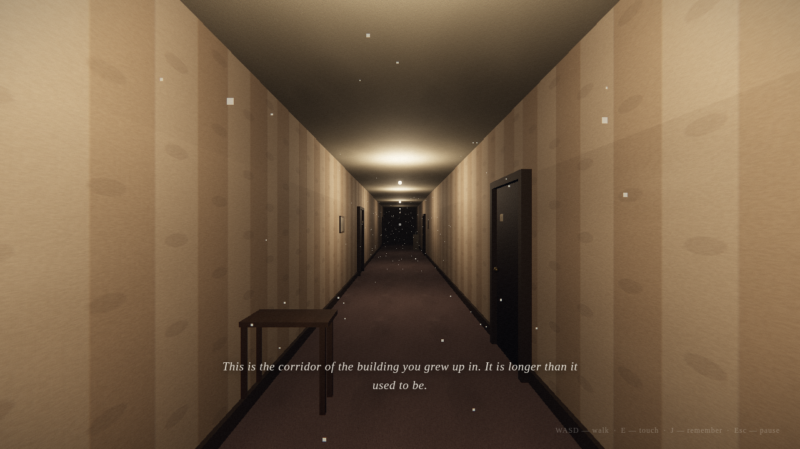

# HIRAETH

*a dream in ten rooms — and, once you’ve woken, five more — and five after*

A first-person dreamcore puzzle game. You drift through ten half-remembered
places — a corridor that grew too long, a pool under the house, a supermarket
an hour after closing — looking for the clues each room hides, unlocking your
way deeper toward waking. And then, past the shore, the five rooms
beneath: you open your eyes at 3:07 and the door is shut. Something
follows you down. It never touches you. Years later the house comes back
once more — not for you — and the last five rooms put you on the other side
of every door, at three hours of the same night. Slightly eerie, slightly
sad. Nothing here will hurt you.

> **hiraeth** *(Welsh)* — homesickness for a home you cannot return to,
> or that never was.



## Play

```bash
npm install
npm run dev        # then open the printed URL
```

Headphones recommended. Progress saves automatically (localStorage).
Room events stop while paused, while reading a note or journal, and while
a phone is held upright. Sound descriptions appear separately from narrative
subtitles, so a knock cannot erase a clue mid-sentence.

| key | |
|---|---|
| WASD / arrows | walk |
| mouse | look |
| shift | hurry (you won't want to) |
| E / click | touch, read, take |
| J | journal — everything you've remembered so far |
| esc | pause / put things down |

On a phone (landscape): left thumb — walk (push to the rim to hurry) ·
right thumb — drag to look · tap a thing, or the floating word, to touch
it · **remember** and **surface** in the corner for the journal and pause.

## The rooms

Each room is a puzzle that gets a little harder than the last: find the
clues, work out what they mean, unlock the way onward. Early rooms ask you
to notice; later rooms ask you to cross-reference, deduce, and remember the
rooms that came before.

Rooms XI–XV misdirect you — plates lie, things move when you look away —
and ask you to listen: sounds have places now. Headphones matter here.
Turn on **describe sounds** in settings for captions with directions.

Rooms XVI–XX exist at three hours — her evening, 3:07, and the morning the
house is emptied — and this time you leave the clues instead of finding
them. The clock in each room moves you between hours; only the night
counts.
The first turn of each clock records the rules in your journal.

## The dreamers — leaderboard

The game times every room (active play only — pausing stops the clock) and
keeps your best per room. The **dreamers** entry in the menu is the
leaderboard: everyone ranked by **rooms completed**, ties broken by **total
time across those rooms**, plus a *room by room* view of the single fastest
crossing of each room. Choose a name there to join — until you do, nothing
leaves your browser, and offline copies simply show your own times.

Scores are held by a tiny backend with two interchangeable
implementations sharing one contract (`server/contract.mjs`): a
zero-dependency Node server (`server/server.mjs`) and a Cloudflare
Worker backed by D1 (`worker/index.mjs`). Both also host the game
itself:

```bash
npm run build && npm start   # game + leaderboard on http://localhost:8091
```

In dev (`npm run dev`), the vite proxy forwards `/api` to that server if
it's running.

## Hosting

The easiest public link is **Cloudflare**: one free Worker serves the
game and the leaderboard together, scores in D1 (the database for this
repo is already provisioned and wired into `wrangler.jsonc`) —

```bash
npm run build
npx wrangler login
npx wrangler deploy      # → https://hiraeth.<you>.workers.dev
```

Alternatives: a ready-made **GitHub Pages** workflow ships in
[`docs/workflows/deploy.yml`](docs/workflows/deploy.yml) (move it to
`.github/workflows/` once — automation isn't allowed to install
workflows), and the Node server / Docker image self-hosts anywhere. All
setups are described in [`docs/HOSTING.md`](docs/HOSTING.md).

## Technical notes

- **Everything is procedural.** No binary assets: textures are generated on
  canvas (wallpaper, pool tile, wood grain, grass), audio is synthesized
  WebAudio (drones, drips, chimes, footsteps, knocks, a music box, a
  piano), positional through HRTF panners, geometry is built from
  primitives. The repo is code all the way down.
- **Stack:** [Three.js](https://threejs.org) + Vite, vanilla JS. ACES
  tonemapping, soft shadows, bloom, and a film-grade post pass (grain,
  vignette, faded lift) do the dreamcore heavy lifting.
- **Engine:** `src/core/` — first-person controller with pointer lock and
  AABB collision, raycast interaction, notes/journal/keypad UI, ambience
  engine, save system.
- **Levels:** `src/levels/Level01.js … Level20.js`, auto-discovered. The
  authoring contract lives in [`docs/LEVEL_API.md`](docs/LEVEL_API.md);
  the room-by-room design bible (all puzzles spoiled) is
  [`docs/DESIGN.md`](docs/DESIGN.md).

## Testing

Levels are verified headless (Chromium + software WebGL):

```bash
npm run shot -- 3          # screenshot level 3 from four angles → shots/
npm run shot -- 18 --hour morning   # rooms XVI–XX also render at their other hours
npm run playtest           # prove every level is solvable end-to-end
npm run playtest -- 7      # just level 7
npm run test:api           # leaderboard server contract tests
npm run test:touch         # the touch layer, on an emulated phone
npm test                   # pure logic (node:test)
npm run test:review         # overlay races, room regressions, pause/portrait/menu flow
npm run test:platform       # departures-frame depth, mouse-look captures, and E interaction
npm run review:shots        # 20 rooms + alternate hours → shots/review/
npm run review:shots -- 20  # one room; XIX and XX include interior viewpoints
npm run review:sheets       # contact sheets from the captured views
```

Every level implements `debugSolve()`, which plays the level through its
real interaction handlers — the playtest fails if a puzzle can't actually
be completed.
The solver uses direct interaction calls and teleports, so it is a puzzle
state check rather than a complete human walkthrough. The review tests add
real keyboard/touch input, aiming checks, layout checks, and regression cases.
See [the room-by-room review](docs/LEVEL_REVIEW.md) for findings and coverage.

`npm run test:touch` boots a room for real (no test mode) in a Chromium
with touch emulation and drives it with synthesized touches: the drift
stick, holding the rim to hurry, the look drag, tapping a thing and
tapping the word, the corner words, and turning the phone upright.

The harness finds Playwright's Chromium by itself; set `CHROMIUM_PATH` to
override. `npm test` runs the unit tests for the pure helpers; `node
tools/audiotest.mjs` builds every synthesized sound headless.

## Build

```bash
npm run build              # static site in dist/, host anywhere
npm start                  # serve dist/ + leaderboard API from one process
```
